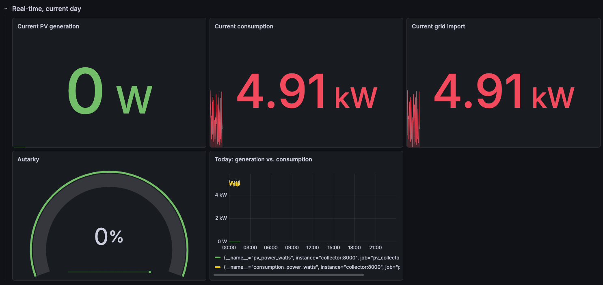
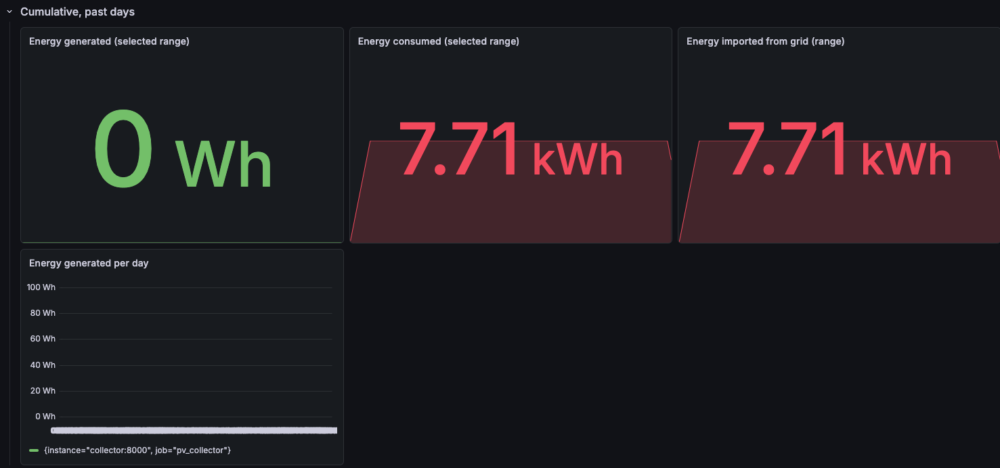

# PV Monitoring Dashboard

Real-time and historical monitoring of the photovoltaic (PV) system on the roof
of Technische Hochschule Ingolstadt (THI). A Python collector reads live power
values (~every 5 s), cleans them, and exposes them to **Prometheus**; **Grafana**
visualises real-time and cumulative energy data.

> **Status:** software-engineering skeleton. The real PV API is not yet available,
> so the collector runs on realistic **mock data** (`MockPVSource`).

## Architecture

```
PV API (future) / MockPVSource
        │  fetch every ~5 s
   ┌────▼─────────────────────────────┐
   │ Collector (Python, src/)         │
   │  client → data_cleaner → metrics │
   │            → data_storage        │
   │  exposes /metrics on :8000       │
   └────┬─────────────────────────────┘
        │  scrape every 5 s
   ┌────▼─────────┐   query   ┌──────────────┐
   │ Prometheus   │◀─────────▶│   Grafana    │
   │ :9090 (TSDB) │           │  :3000 (UI)  │
   └──────────────┘           └──────────────┘
```

| Component     | Technology     | Role                                             |
|---------------|----------------|--------------------------------------------------|
| Collector     | Python         | Fetch → clean → calculate → export metrics       |
| Storage       | Prometheus     | Time-series database + per-period aggregation    |
| Dashboard     | Grafana        | Real-time (today) + cumulative (past days) views |
| Orchestration | Docker Compose | Runs all three services together                 |

## Quick start

**Prerequisite:** Docker Desktop running.

```bash
git clone https://github.com/Patxita/PVProjekt.git
cd PVProjekt
docker compose up --build
```

Then open:
- **Grafana dashboard:** http://localhost:3000  (login `admin` / `admin`)
- **Prometheus:** http://localhost:9090
- **Collector metrics:** http://localhost:8000/metrics

Stop with `Ctrl+C`, then `docker compose down`.

## Project structure

```
src/
  main.py                 # collection loop (entry point)
  backend/
    models.py             # PVReading data contract
    interfaces.py         # PVDataSource protocol
    mock_source.py        # mock data generator
    client.py             # real API client (stub until API exists)
    data_cleaner.py       # validates/repairs readings
    metrics.py            # derives KPIs (self-consumption, autarky, energy)
    data_storage.py       # Prometheus exporter
tests/                    # unit + integration tests
prometheus/prometheus.yml # scrape config
grafana/provisioning/     # auto-loaded datasource + dashboard
docs/                     # dashboard spec, task distribution, images
```

## Metrics & KPIs

See [docs/dashboard_spec.md](docs/dashboard_spec.md) for the full specification of
collected metrics, derived KPIs, and dashboard panels.




## Development

```bash
python3 -m venv .venv && source .venv/bin/activate
pip install -r requirements-dev.txt
python -m pytest -v                 # run tests
ruff check . && black --check .     # lint + format check
```

## CI

GitHub Actions (`.github/workflows/ci.yml`) runs ruff, black, and pytest on every
push/PR, then builds the Docker image to verify containerization.

## Switching from mock data to the real API

1. Put the endpoint in a local `.env` file (gitignored): `PV_API_URL=https://...`
2. In `src/main.py`, change `source = MockPVSource()` to `source = ApiClient()`.
3. Implement `ApiClient.fetch` / `_parse` against the API specification.

No other code changes are needed — both classes implement `PVDataSource`.

## Assumptions & simplifications

- The PV system exposes instantaneous **power in watts (W)**; energy (Wh/kWh) is derived.
- The mock solar curve uses **UTC** time, so the generation peak occurs at 12:00 UTC.
- Mock peak power (30 kW) and base load (5 kW) are plausible placeholders, to be replaced with the real array's rated power once known.

## Team & task distribution

See [docs/task_distribution.md](docs/task_distribution.md).