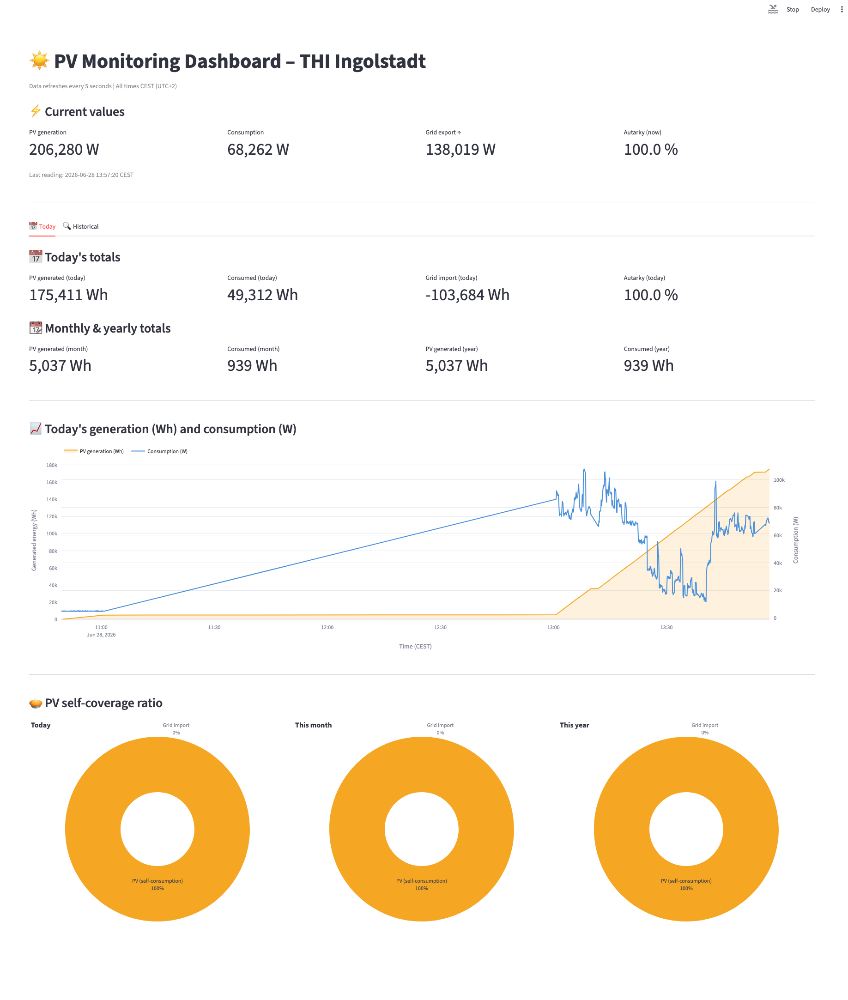
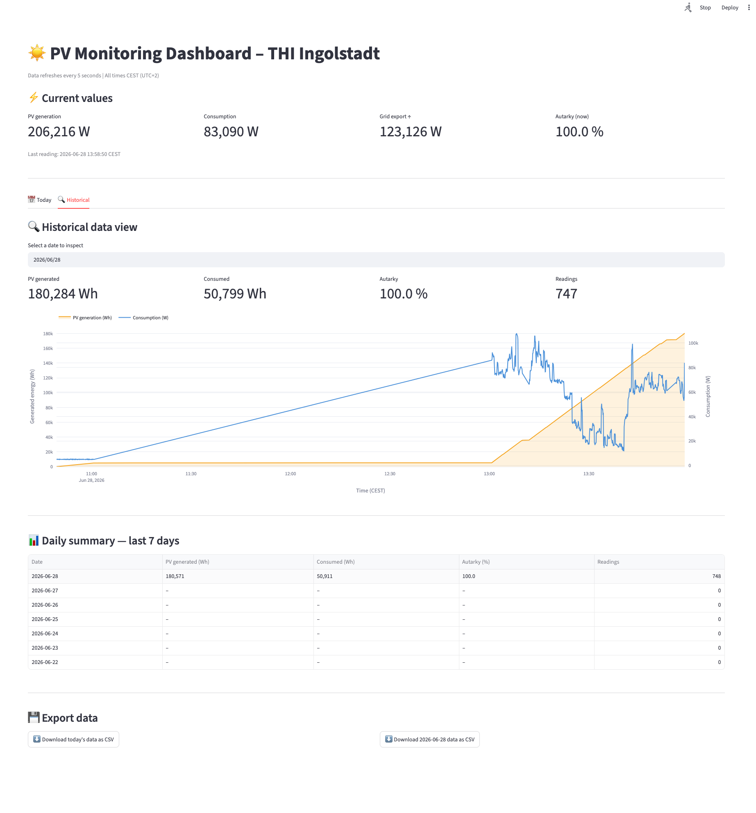

# ☀️ PV Dashboard – THI Ingolstadt

A real-time photovoltaic monitoring dashboard built for the THI (Technische Hochschule Ingolstadt) Data Science course.

The system collects live PV data from the university's API every 5 seconds, stores it in a local SQLite database, and displays it in an auto-refreshing Streamlit dashboard.

---

## Features

- Live metric cards: current PV generation, consumption, grid import, and autarky
- Daily, monthly, and yearly energy totals
- Time-series chart: today's generation (Wh) and consumption (W) in one diagram
- Three pie charts: PV self-coverage ratio for today, this month, and this year
- Fully containerised with Docker
- CI/CD pipeline via GitHub Actions

---

## Screenshots

### Today's view


### Historical view


## Project Structure

```
PVProjekt_THI/
├── src/
│   ├── main.py                 # Data collection loop
│   └── backend/
│       ├── client.py           # Live API client
│       ├── data_cleaner.py     # Validation and repair of raw readings
│       ├── data_storage.py     # SQLite storage layer
│       ├── metrics.py          # KPI calculations
│       ├── models.py           # PVReading data model
│       └── mock_source.py      # Synthetic data for offline use
├── tests/                      # Unit and integration tests
├── app.py                      # Streamlit dashboard
├── Dockerfile
├── docker-compose.yml
├── requirements.txt
└── .github/workflows/ci.yml    # CI/CD pipeline
```

---

## Installation (local)

### Prerequisites

- Python 3.12+
- Git

### Steps

```bash
# 1. Clone the repository
git clone https://github.com/Patxita/PVProjekt_THI.git
cd PVProjekt_THI

# 2. Create and activate a virtual environment
python -m venv .venv
source .venv/bin/activate        # macOS/Linux
# .venv\Scripts\activate         # Windows

# 3. Install dependencies
pip install -r requirements.txt
pip install -r requirements-dev.txt

# 4. Create a .env file with your API credentials (never commit this file!)
echo "PV_API_URL=https://jupyterhub-wi.rz.fh-ingolstadt.de:8443/data" > .env
echo "PV_API_KEY=your_api_key_here" >> .env

# 5. Start the data collector (in one terminal)
python -m src.main

# 6. Start the dashboard (in a second terminal)
streamlit run app.py
```

The dashboard opens automatically at **http://localhost:8501**.

---

## Installation (Docker)

### Prerequisites

- Docker
- Docker Compose

### Steps

```bash
# 1. Clone the repository
git clone https://github.com/Patxita/PVProjekt_THI.git
cd PVProjekt_THI

# 2. Create a .env file with your API credentials (never commit this file!)
echo "PV_API_URL=https://jupyterhub-wi.rz.fh-ingolstadt.de:8443/data" > .env
echo "PV_API_KEY=your_api_key_here" >> .env

# 3. Build and start both services
docker compose up --build
```

The dashboard is then available at **http://localhost:8501**.

To stop: `docker compose down`

---

## Running the Tests

```bash
pytest tests/ -v
```

---

## Environment Variables

| Variable | Description | Required |
|----------|-------------|----------|
| `PV_API_URL` | URL of the PV data API | Yes (for live data) |
| `PV_API_KEY` | API key for authentication | Yes (for live data) |

These must be stored in a `.env` file or set in your environment. They are listed in `.gitignore` and must **never** be committed to version control.

---

## Team

| Name | Role |
|------|------|
| Franziska | Storage, frontend, Docker, CI/CD |
| Natalia | API client, data cleaning, metrics, tests |
